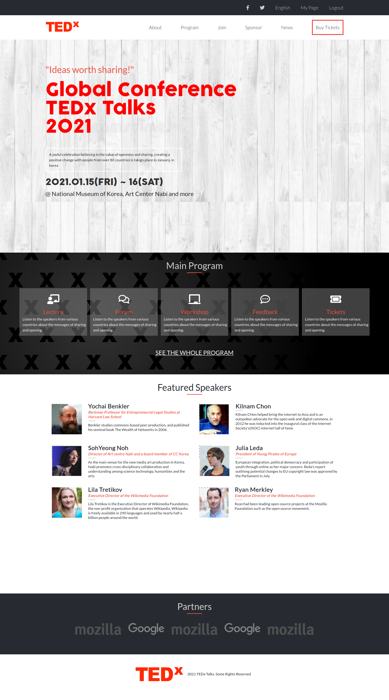

# A TEDx Conference Website.

This is a TEDx conference website, which has three pages: 1- The Main Page 2- The About Us page 3- The Tickets page. The website provides information about the global TEDx conference to be held on Jan 2021. It has the details of all the speakers and a link from where tickets can be bought.

Additional description about the project and its features.

## Built With

- HTML5
- CSS3
- Bootstrap 4
- Media Queries

## Live Demo

[Live Demo Link](https://saimaanis21.github.io/Capstone/index.html)

# Getting Started 🚀

These instructions will get you a copy of the project up and running on your local machine.

## How To Use 🔧

From your command line, first clone the project:

- Run the command line terminal from your local folder
- Clone this repository (git clone https://github.com/saimaAnis21/Capstone.git)
- Open the Local Copy of your repository and open the command line terminal from there then run the   following command (git pull)

## Authors

👤 **Author**

Saima Anis

- GitHub: [@saimaAnis21](https://github.com/saimaAnis21)
- Twitter: [@SheTALKS](https://twitter.com/SheTALKS6)
- LinkedIn: [Saima Anis](https://www.linkedin.com/in/saima-anis-3a07921b2/)

## 🤝 Contributing

Contributions, issues, and feature requests are welcome!

## Show your support

Give a ⭐️ if you like this project!

## Acknowledgments

- Font Awesome icons
- COCOGOOSE font
- GOOGLE font Lato

## 📝 License

Copyright 2020 Saima Anis

Permission is hereby granted, free of charge, to any person obtaining a copy of this software and associated documentation files (the "Software"), to deal in the Software without restriction, including without limitation the rights to use, copy, modify, merge, publish, distribute, sublicense, and/or sell copies of the Software, and to permit persons to whom the Software is furnished to do so, subject to the following conditions:

The above copyright notice and this permission notice shall be included in all copies or substantial portions of the Software.

THE SOFTWARE IS PROVIDED "AS IS", WITHOUT WARRANTY OF ANY KIND, EXPRESS OR IMPLIED, INCLUDING BUT NOT LIMITED TO THE WARRANTIES OF MERCHANTABILITY, FITNESS FOR A PARTICULAR PURPOSE AND NONINFRINGEMENT. IN NO EVENT SHALL THE AUTHORS OR COPYRIGHT HOLDERS BE LIABLE FOR ANY CLAIM, DAMAGES OR OTHER LIABILITY, WHETHER IN AN ACTION OF CONTRACT, TORT OR OTHERWISE, ARISING FROM, OUT OF OR IN CONNECTION WITH THE SOFTWARE OR THE USE OR OTHER DEALINGS IN THE SOFTWARE.
